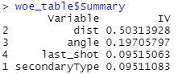
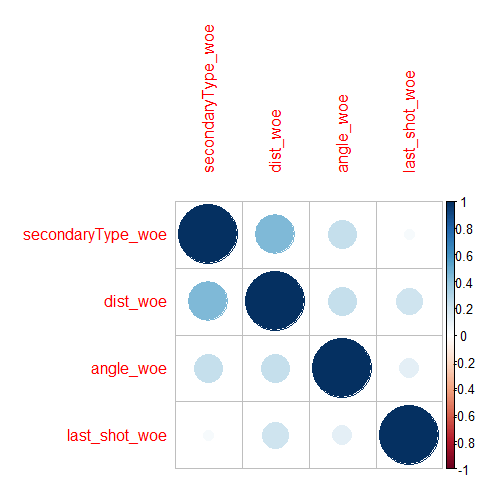
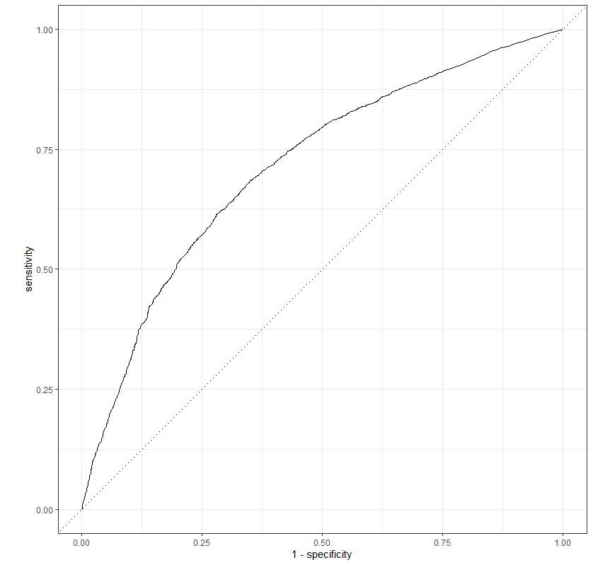
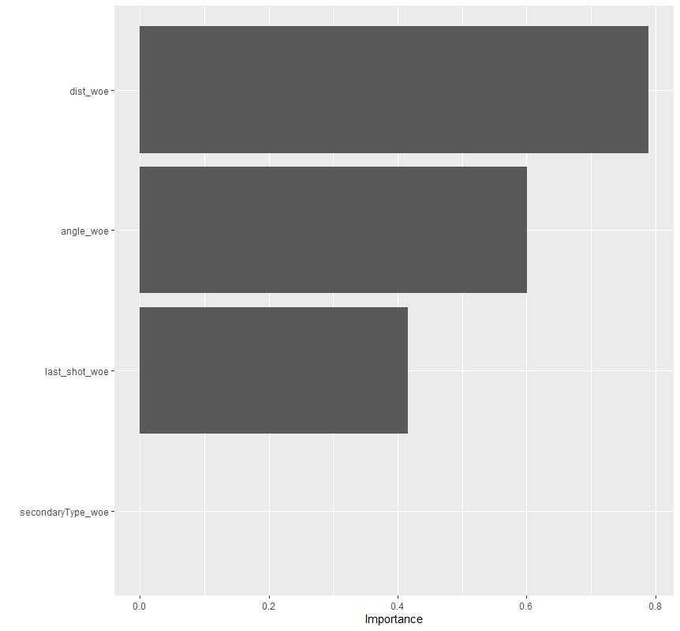
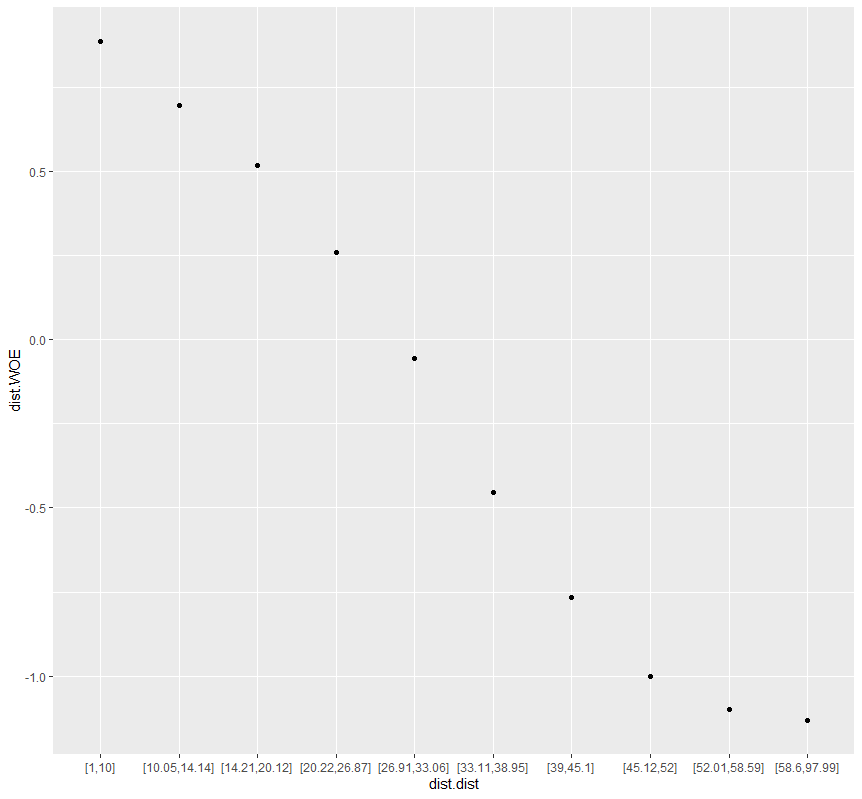
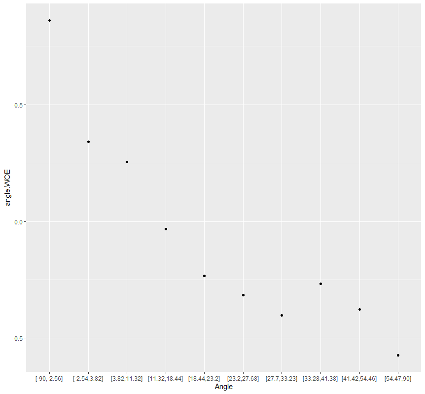
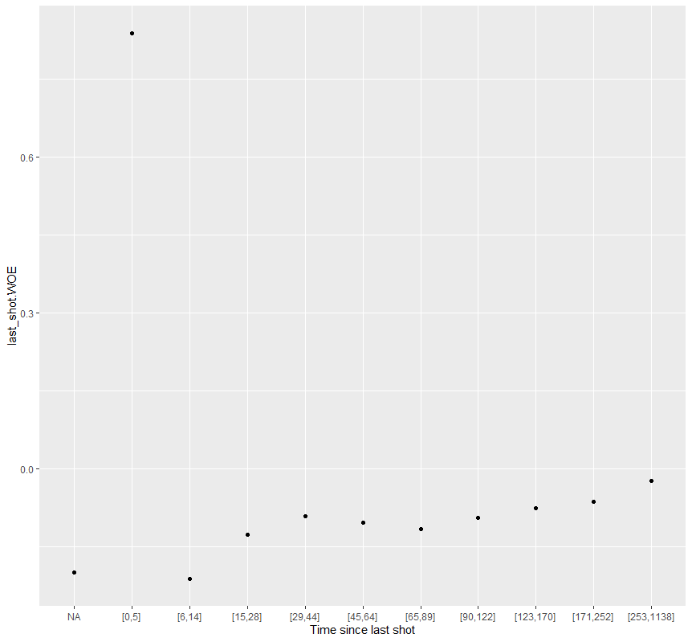

# NHL Expected Goals (xG) Model

This model is calculating 'expected goals', ie the likelihood that a particular shot in an NHL game will turn into a goal.  There are many such models out there of varying complexity, often using proprietary data like pre-shot movement.  This one is faily simple by comparison, using only publicly available data (see NHL API script) and illustrative of how one could construct a more robust model.  It is trained on NHL shot data from 2011 to 2020, and is using a handful of features including shot type, shot distance, shot angle, and time since last shot (rebound).  'Expected Goals' can be used as a better indication of how many quality scoring chances a team creates during a game, rather than using more traditional metrics like shots on goal, corsi or fenwick shots.

### Data Preprocessing

First we define which features we are going to use:

`predictor_names <- c("secondaryType",
                     "dist",
                     "angle",
                     "last_shot")`
                     
Next, we will load some previously saved data from the NHL API which includes all the play by play data from 2011 to 2020:

```
play_data <- c("plays_2011.rds",
               "plays_2012.rds",
               "plays_2013.rds",
               "plays_2014.rds",
               "plays_2015.rds",
               "plays_2016.rds",
               "plays_2017.rds",
               "plays_2018.rds",
               "plays_2019.rds",
               "plays_2020.rds")
```

One we have the data, we need to do some pre-processing on it.  First, we filter to only shot and goal events to train our model.  Unfortunately we can't use blocked shots, since it notes the location of the shot block, not the original shot.  Also we are not able to use missed shots, since frustratingly the NHL data doesn't include the shot type for a missed shot, which is a key feature of our model.
We also exclude all period == 5 events, as those are shootout events.
Next we calculate shot distance and angle from the x and y location of each shot.  Note that centre ice is 0,0 and the goal line is at x=89.  For shots that recorded at x>89, ie behind the net, we change those to goal line shots at 89ft.  Y locations are + and - for left and right wing, we use a net width of 6 ft (+/- 3 ft) from centre, and calculate the angle from the closest edge of the net.
Finally, we create a helper variable of time in seconds from period start and then calculate the delay from the previous shot.  The assumption is that shots in short duration, ie rebounds, will result in a higher xG probability.

### WOE (Weight of Evidence) Transformation

For this model we then do a WOE transformation on each feature, the method is described in detail here: [https://www.listendata.com/2015/03/weight-of-evidence-woe-and-information.html](https://www.listendata.com/2015/03/weight-of-evidence-woe-and-information.html).

Some benefits of WOE is it that nicely handles all our categorical values with needing any dummy variables, will deal with missing values seamlessly, and the the WOE and IV (Information Value) scores will give us some measure of feature importance.

` library(Information) # WOE and IV functions `

` woe_table <- create_infotables(data = xg_data, y="Event") `

This creates our WOE tables for each feature, and then I use a for loop to extract all the woe tables and transform each variable based on it's value, and create new transformed columns with a "woe" suffix and select only those for our training.  Below are the information values (IV) for each feature, looks like all are significant and the most important variable is shot distance



I wouldn't expect any of the features chosen to be closely correlated with each other, but let's check with a correlation plot



### Train Model

To train the model on the WOE transformed data, I took a sample of 100k observations from the overall shot attempt total of around 750k.  I didn't use the entire sample mainly to increase the speed of training the model.  I split the data into a standard 75% training and 25% testing, and setup a cross validation using 10 folds.  Then the code below sets up the model pipeline for training and tuning which allows you to choose 3 algorithms for training (LR = Logistic Regression, RF = Random Forest, XGB = XGBoost).  For this model I chose LR as it produces a good model with minimal training time, using a Lasso regularization to tune a penalty factor to simplify our model if possible and reduce overfitting.

```
if (algorithm == "LR") {
  mod <- logistic_reg(penalty = tune(), mixture = 1) %>%
         set_engine("glmnet")
  mod_grid <- tibble(penalty = 10^seq(-4, -1, length.out = 30))
} else if (algorithm == 'RF') {
  mod <- rand_forest(mtry = tune(), min_n = tune(), trees = tune()) %>% 
         set_engine("ranger", importance = "permutation") %>% 
         set_mode("classification")
  mod_grid <- mod %>%
              parameters() %>%
              finalize(select(sample_df,-Event,-one_of(id_names))) %>%
              grid_max_entropy(size = 10)
} else if (algorithm == 'XGB') {
  mod <- boost_tree(
         trees = 4,
         tree_depth = tune(), min_n = tune(),
         loss_reduction = tune(),                     ## first three: model complexity
         sample_size = tune(), mtry = tune(),         ## randomness
         learn_rate = tune(),                         ## step size
  ) %>%
    set_engine("xgboost") %>%
    set_mode("classification")
  mod_grid <- grid_latin_hypercube(
    tree_depth(),
    min_n(),
    loss_reduction(),
    sample_size = sample_prop(),
    finalize(mtry(), train_data),
    learn_rate(),
    size = 30
  )
}
```

I then add this model to my tidymodels 'recipe', and also apply the ROSE algorithm to help balance our dataset by creating synthetic samples.  Our 'Event' of a goal represents about 10% of total sample, so not sure if this step is actually needed for our dataset, but I left it in for this iteration.  Finally, let's do some magic by training and tuning our model and setting our evaluation metrics to AUC, Accuracy, Sensitivity and Specificity so we can judge how good our model is.  I then choose the best model based on best AUC score.

```
metric_list <- metric_set(roc_auc, accuracy, sens, spec)

res <- pred_wflow %>%
       tune_grid(resamples = folds,
                 grid = mod_grid,
                 control = control_grid(save_pred = TRUE, event_level = "second"),
                 metrics = metric_list)

best_tune <- res %>% select_best("roc_auc")
```

### Train Model

Finally, I evaluate our model on unseen data from our holdout test set using our best tune.

```
final_fit <- final_wflow %>%
             last_fit(data_split, metrics = metric_list)
```

Below is the ROC chart our final model, with an **AUC of 71.5%**.  This isn't bad for a first try with only a few features, will try to improve that in future iterations.



Taking a look at our feature importance, it shows that, not surprisingly, distance to goal is the most important predictor of a goal.  What is interesting is that the model dropped the shot type feature as part of tuning process, I will investigate that further.



Looking at the WOE charts for several of the variables, we can see some interesting trends.  The likelihood of a shot turning into a goal decreases steadily as the distance increases



Shot angle is also a strong predictor of a goal, with goal likelihood decreasing steadily as angle increases.  There is an exception for goals shot at greater than 33 degree angle where the probability appears to increase slightly.  Could this be skaters setting up on the power play on the hash marks for a cross ice one timer, ie setting up in the 'Petterzone'?



Finally, let's look at time between shots.  Here we see the effect of the rebound, where shots taken within 5 seconds of the previous shot have a much higher likelihood to result in a goal.



### Save Final Model

As a last step, I save the model and woe tables in .rds format.  This will allow me to calculate xG values for new data, and determine just how bad the 2021-2022 Vancouver Canucks are! 

```
final_model <- final_fit$.workflow[[1]]
saveRDS(final_model, file = paste0(Sys.Date(),"_",model_type,"_",model,"_",brand,"_",segment,"_",algorithm,"_v",revision,".rds"))

saveRDS(woe_table, file = paste0(Sys.Date(),"_",model_type,"_",model,"_",brand,"_",segment,"_WOE.rds"))
```

